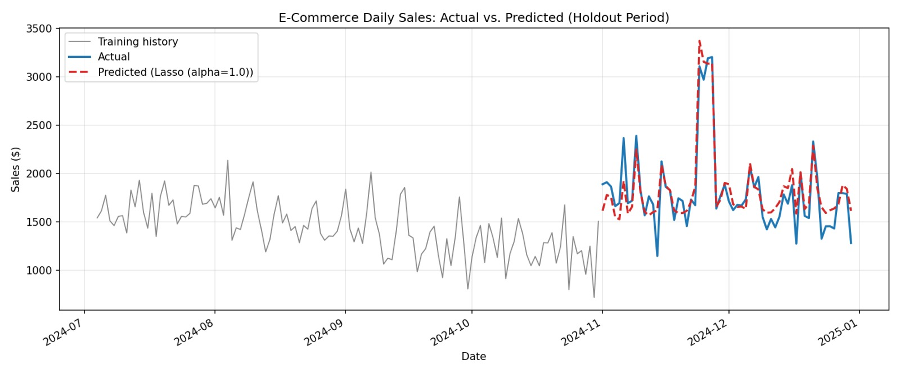
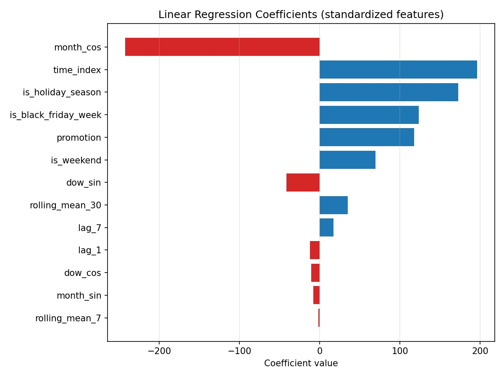
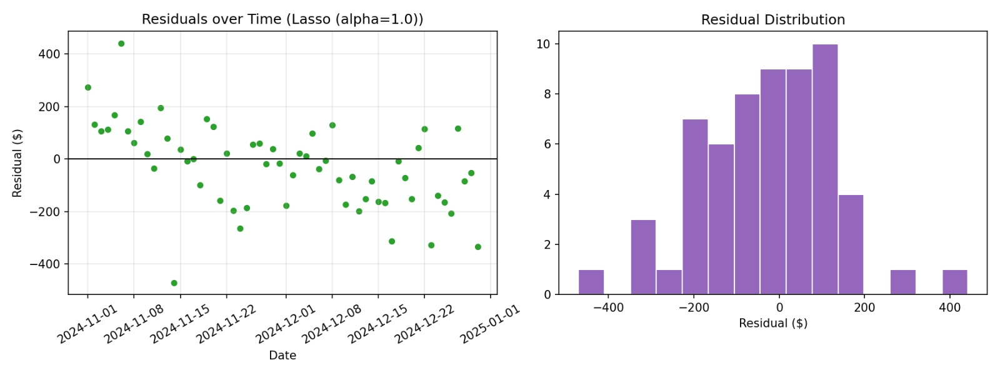

# E-Commerce Sales Forecasting with Linear Models

A complete, runnable example of forecasting daily e-commerce sales using
linear regression (plus Ridge/Lasso for comparison). Built with
`pandas`, `numpy`, `scikit-learn`, and `matplotlib`.



## Requirements

- Python 3.9+
- Packages listed in `requirements.txt`

## Installation

```bash
git clone https://github.com/<your-username>/<your-repo>.git
cd <your-repo>
pip install -r requirements.txt
```

## Usage

```bash
python ecommerce_sales_forecast.py
```

This regenerates the synthetic dataset, retrains all three models, prints
the metrics table to the console, and (re)writes the CSV/PNG outputs listed
below into the project folder.

## Files
- `ecommerce_sales_forecast.py` — the full pipeline (data → features → train → evaluate → plots)
- `requirements.txt` — Python dependencies
- `synthetic_sales_data.csv` — the generated dataset (730 days, 2023–2024)
- `model_comparison.csv` — MAE / RMSE / MAPE / R² for all three models
- `forecast_actual_vs_predicted.png` — 60-day holdout forecast vs. actuals
- `residual_analysis.png` — residuals over time + distribution
- `feature_coefficients.png` — standardized coefficients from the Linear Regression model

## Approach

**1. Data.** Synthetic daily sales with a growth trend, weekly seasonality
(weekend/Friday lift), yearly seasonality (Q4 ramp-up), a Black Friday /
Cyber Monday spike, random promotions, and noise — the same ingredients
you'd see in real retail data.

**2. Features.**
- `time_index` — captures the long-term trend
- `dow_sin/cos`, `month_sin/cos` — cyclical encodings of weekday/month, so a linear model can represent seasonality without one-hot exploding the feature space
- `is_weekend`, `is_holiday_season`, `is_black_friday_week` — calendar flags a retailer knows in advance
- `promotion` — whether a promo is running that day
- `lag_1`, `lag_7`, `rolling_mean_7/30` — recent sales momentum

**3. Models.** Linear Regression, Ridge, and Lasso (all on standardized
features) trained on all but the last 60 days, tested on that final 60-day
window.

**4. Results** (60-day holdout):

| Model | MAE | RMSE | MAPE | R² |
|---|---|---|---|---|
| Linear Regression | ~126 | ~163 | ~7.6% | ~0.85 |
| Ridge | ~126 | ~163 | ~7.6% | ~0.85 |
| Lasso | ~126 | ~162 | ~7.6% | ~0.86 |

(Exact numbers are in `model_comparison.csv` — they'll shift slightly if you
re-run with a different random seed.)




## Using your own data

Replace the call to `generate_synthetic_data()` in `run_pipeline()` with:

```python
raw = pd.read_csv("your_sales.csv", parse_dates=["date"])
```

Your CSV needs at minimum `date` and `sales` columns. If you have a
promotions column, keep it named `promotion` (0/1) or update `feature_cols`
accordingly. Everything else (feature engineering, training, evaluation,
plotting) works unchanged.

## Key takeaway on linear models for forecasting

Linear regression does well here (R² ≈ 0.85) *because* the seasonality and
event effects were turned into explicit features (cyclical encodings,
calendar flags, lags). A linear model can't discover "sales spike every
Black Friday" on its own — it can only use that pattern once you hand it a
feature that encodes it. That's the main skill in this kind of forecasting:
less about the model, more about turning calendar/business knowledge into
columns the model can use. For sales driven by more complex interactions
(e.g., promotion effect depends on season), tree-based models (Random
Forest, Gradient Boosting) typically do better without needing that manual
interaction engineering — a natural next step if you want to compare.

## License

MIT — feel free to use, modify, and share.
